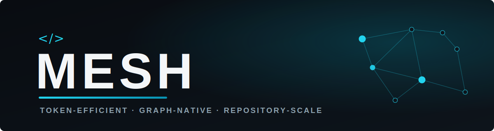

  

<h3>A Token-Efficient, Graph-Native Logic for Repository-Scale Code Agents</h3>

<em>Most of a coding agent's token budget goes to finding the right code, not reasoning about it. Mesh is a pre-inference control plane that assembles budgeted, cited evidence before every model turn.</em>

---

## The paper

Read online at **[try-mesh.github.io/MESH](https://try-mesh.github.io/MESH/)**, or open any edition directly.

| Edition | Pages | Description | Link |
|---|:--:|---|:--:|
| **Full working draft** | 58 | The complete paper — every section, references, and appendices | [PDF](https://try-mesh.github.io/MESH/mesh-paper.pdf) |
| **Condensed edition** | 22 | The core architecture and results, in roughly twenty pages | [PDF](https://try-mesh.github.io/MESH/mesh-paper-condensed.pdf) |
| **Outreach summary** | 2 | A one-page overview and the headline result | [PDF](https://try-mesh.github.io/MESH/mesh-paper-outreach.pdf) |
| **Main text** | 53 | Content only — sections 1–18, references and appendices removed | [PDF](https://try-mesh.github.io/MESH/mesh-paper-maintext.pdf) |
| **References and appendices** | 8 | Companion volume — bibliography and Appendix A–F | [PDF](https://try-mesh.github.io/MESH/mesh-paper-refs-appendix.pdf) |

New readers may prefer the outreach summary (about two minutes) or the condensed edition (about twenty minutes).

---

## Key results

| Result | Detail |
|---|---|
| **Hit@1 of 79.9%** | On a 229-task localization suite across six external repositories — 2.4× the strongest single-method retrieval baseline, at McNemar p&nbsp;&lt;&nbsp;0.001. |
| **−69.7% tokens per query** | And −55.5% over eight-turn sessions versus a competent grep-based agent, with the model held constant and only the retrieval scaffold changed. |
| **Graph-native retrieval** | A deterministic Repository Intelligence Graph answers symbol-aware lookup and dependency-impact queries that embedding and lexical search structurally cannot. |

---

## What's inside

- **Part I — Foundations.** The lost-in-the-middle problem, the locality unit, and a constrained-utility model of the agent loop.
- **Part II — Architecture.** Five environment-strippable layers: representation, evidence, context, economics, and runtime.
- **Part III — Evaluation.** Retrieval ablation, needle-in-a-haystack, multi-turn economics, a controlled head-to-head against state-of-the-art retrieval, and a same-model scaffold study.
- **Part IV — Discussion.** Comparison with alternative architectures, threats to validity, and limitations.

---

Mesh &middot; <a href="https://try-mesh.com">try-mesh.com</a> &middot; Edgar Elmo Baumann and Philipp Nils Horn &middot; June 2026

